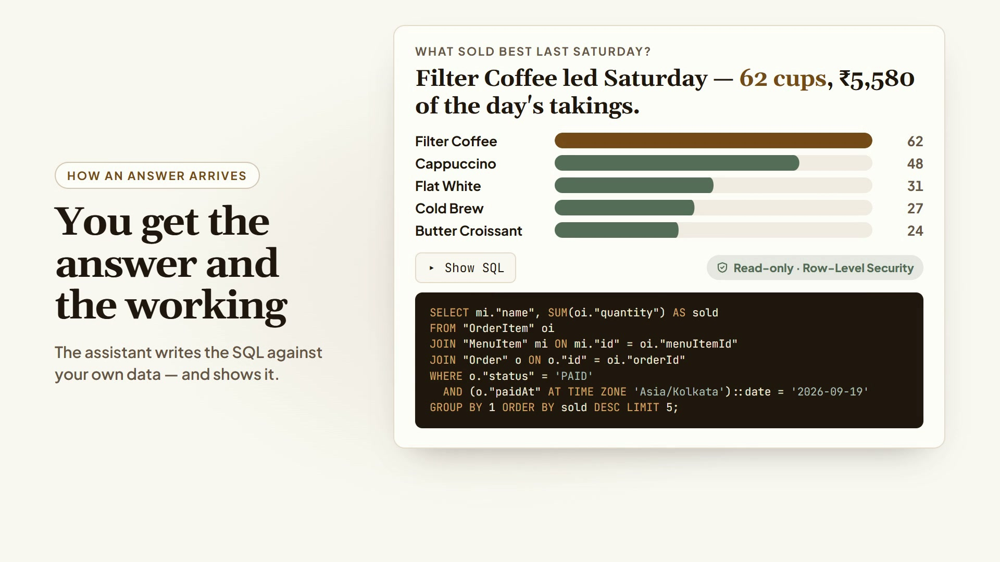

# Operato

The AI operating system for restaurants — a multi-tenant SaaS whose AI assistant talks to the tenant's _real_ business database (text-to-SQL), with weekly auto-summaries and smart inventory alerts. Restaurant is vertical #1 of a vertical-extensible platform.

<p align="center">
  <a href="brag-output/brag.mp4">
    <picture>
      <source media="(prefers-color-scheme: dark)" srcset="brag-output/brag-dark.jpg" />
      
    </picture>
  </a>
  <br />
  <sub>▶️ <a href="brag-output/brag.mp4">Watch the 23-second tour</a> · 📖 <a href="docs/how-it-works.html">How Operato works: flows, architecture and code</a></sub>
</p>

## Stack

Next.js 16 (App Router, RSC) · TypeScript (strict) · Prisma + Neon Postgres · **Better Auth** · **Razorpay** · **Google Gemini 2.5 Flash via the Vercel AI SDK** · Shadcn/Tailwind · TanStack Query · Zod · Playwright · Vercel Cron.

> The stack changed from the original plan (Clerk → Better Auth, Stripe → Razorpay, Anthropic → Gemini). See [docs/stack-changes.md](docs/stack-changes.md).
>
> **Next.js 16 is not Next.js 15.** `params`/`cookies()`/`headers()` are Promises, and `middleware.ts` is now `proxy.ts`. See [docs/nextjs-16-notes.md](docs/nextjs-16-notes.md) before writing route code.
>
> **Prisma is on 7.x**, which also breaks with what an LLM "knows": configuration lives in [prisma.config.ts](prisma.config.ts) (not the `prisma` key in `package.json`), `.env` is **no longer auto-loaded** by the CLI, and `prisma db execute --url` was removed in favour of the config's `datasource`.

## Status

Greenfield. The repo is a bare Next 16 scaffold (`src/app/{layout,page}.tsx`) plus the plan and docs. Prisma, Better Auth, Razorpay, the AI SDK, Shadcn, and Playwright are **not installed yet** — the `db:*` and `test:e2e` scripts in `package.json` are placeholders that will fail until they are.

## Getting started

### 1. Prerequisites

Node 20+, a package manager, and a `psql` client (for the read-only role in step 3).

```bash
npm install
cp .env.example .env
```

### 2. Get the credentials

You only need **Neon** and the two generated secrets to start building auth, the schema, and the dashboard shell. Gemini, Razorpay, and Uploadthing can be filled in when you reach those features — leave them blank until then.

| Var                              | Where to get it                                                                                                                                    | Needed by         |
| -------------------------------- | -------------------------------------------------------------------------------------------------------------------------------------------------- | ----------------- |
| `DATABASE_URL`                   | [neon.tech](https://neon.tech) → new project → **Connection string** (pooled — the host with `-pooler`). Free tier is fine.                          | Day one           |
| `DIRECT_URL`                     | The same string with `-pooler` dropped from the host. Prisma Migrate needs a real session, not a pgbouncer transaction.                              | Day one           |
| `DATABASE_URL_AI`                | Not handed to you — you create the role yourself. See step 3.                                                                                        | The AI path       |
| `BETTER_AUTH_SECRET`             | Generate: `openssl rand -base64 32`. Rotating it invalidates every session.                                                                          | Day one           |
| `BETTER_AUTH_URL` / `NEXT_PUBLIC_BETTER_AUTH_URL` | `http://localhost:3000` locally; the deployed origin in prod. A mismatch breaks OAuth callbacks and cookie domains.                 | Day one           |
| `CRON_SECRET`                    | Generate: `openssl rand -base64 32`. The cron route must 401 without it, or it's a public endpoint.                                                  | Weekly summary    |
| `GOOGLE_GENERATIVE_AI_API_KEY`   | [aistudio.google.com/apikey](https://aistudio.google.com/apikey) → **Create API key**. Free, but the RPM is tight — the cron has to be throttled.    | AI features       |
| `GOOGLE_CLIENT_ID` / `_SECRET`   | Optional. [Google Cloud console](https://console.cloud.google.com/apis/credentials) → OAuth client (Web). Only if social sign-in is on.              | Optional          |
| `RAZORPAY_KEY_ID` / `_SECRET`    | [dashboard.razorpay.com](https://dashboard.razorpay.com) → **Account & Settings → API Keys → Generate**. Test mode needs no KYC; live mode does.     | Billing           |
| `NEXT_PUBLIC_RAZORPAY_KEY_ID`    | Same Key ID as above. Public by design — Checkout.js needs it. The **secret** never goes near `NEXT_PUBLIC_`.                                        | Billing           |
| `RAZORPAY_WEBHOOK_SECRET`        | A value **you invent**, then paste into **Settings → Webhooks** when you register the endpoint. It is *not* the key secret — mixing them up is the classic bug. | Billing |
| `RAZORPAY_PRO_PLAN_ID`           | Razorpay dashboard → **Subscriptions → Plans → Create Plan** ("Operato Pro"). One plan per environment; test and live plan ids differ.               | Billing           |
| `UPLOADTHING_TOKEN`              | [uploadthing.com](https://uploadthing.com) → app → **API Keys**. Confirm the var name against the installed major — it changed in v7.                | Menu images       |

### 3. Create the AI read-only role

`DATABASE_URL_AI` is a **security boundary, not a convenience**: it is what makes a model-generated `DELETE` impossible rather than merely unlikely. A SELECT-only string check in the prompt is not security. Run this against your Neon database once:

**Create it with `CREATE ROLE` in SQL — never through the Neon console.** A role created in the console is granted `neon_superuser`, which carries `BYPASSRLS`; Row-Level Security would then bind nothing and the AI could read every tenant.

```sql
CREATE ROLE operato_ai_ro LOGIN PASSWORD 'a-strong-password';
GRANT CONNECT ON DATABASE neondb TO operato_ai_ro;
GRANT USAGE ON SCHEMA public TO operato_ai_ro;

-- Belt and braces: even if a GRANT is one day too generous, the role cannot write,
-- and it cannot tie up a connection with a runaway model-generated query.
ALTER ROLE operato_ai_ro SET default_transaction_read_only = on;
ALTER ROLE operato_ai_ro SET statement_timeout = '5s';
```

Note what is **deliberately absent**: no `GRANT SELECT ON ALL TABLES`, and no `ALTER DEFAULT PRIVILEGES … GRANT`. A blanket default is fail-**open** — every table created later is silently readable by the AI *and* has no RLS policy until someone remembers to add one. That is not hypothetical: it is exactly how Better Auth's `account` (password hashes) and `session` (session tokens) tables first became AI-readable here. Instead, each migration that adds a tenant table opts it in explicitly:

```sql
ALTER TABLE "New" ENABLE ROW LEVEL SECURITY;
CREATE POLICY tenant_isolation ON "New"
  USING ("restaurantId" = current_setting('app.restaurant_id', true));
GRANT SELECT ON "New" TO operato_ai_ro;   -- only if the AI should read it
```

A forgotten `GRANT` means the AI cannot see a table — a visible, harmless bug. A forgotten `REVOKE` under the old scheme meant the AI could see everything.

Put the role's connection string in `DATABASE_URL_AI`, then **prove the boundary holds** rather than assuming it. Three checks, all of which must pass:

```sql
-- 1. It cannot write. Must fail: "cannot execute CREATE TABLE in a read-only transaction".
CREATE TABLE ai_should_not_write (id int);

-- 2. RLS actually binds it — both must be false, or policies are ignored entirely.
SELECT rolsuper, rolbypassrls FROM pg_roles WHERE rolname = 'operato_ai_ro';

-- 3. No table is readable-but-unprotected. Must return ZERO rows.
SELECT c.relname FROM pg_class c JOIN pg_namespace n ON n.oid = c.relnamespace
WHERE n.nspname = 'public' AND c.relkind = 'r'
  AND has_table_privilege('operato_ai_ro', c.oid, 'SELECT')
  AND NOT c.relrowsecurity;
```

Check 3 is the one worth wiring into CI — it catches a missing policy, an over-broad grant, and any future regression in a single query. `assertAiRoleIsSafe()` in [src/lib/db.ts](src/lib/db.ts) enforces checks 1 and 2 at runtime.

The RLS policies themselves are applied by migration — see [docs/plan-code-review.md](docs/plan-code-review.md).

### 4. Run it

```bash
npm run db:migrate -- --name init   # create + apply the schema
npm run db:seed                     # demo data, so the AI features have something to say
npm run dev                         # http://localhost:3000
```

## Commands

| Command                | What it does                                            |
| ---------------------- | ------------------------------------------------------- |
| `npm run dev`          | Dev server (Turbopack — the default in 16)              |
| `npm run typecheck`    | `tsc --noEmit`                                          |
| `npm run lint`         | ESLint (**not** `next lint` — removed in Next 16)       |
| `npm run db:migrate`   | Create + apply a migration. Never edit a shipped one.   |
| `npm run db:generate`  | Regenerate the Prisma client                            |
| `npm run db:seed`      | Load demo data                                          |
| `npm run db:studio`    | Prisma Studio                                           |
| `npm run test:e2e`     | Playwright                                              |

> Never run `prisma migrate reset` (drops the database) or `prisma db push` (bypasses migration history).

## Docs

| Doc                                                    | What's in it                                              |
| ------------------------------------------------------ | --------------------------------------------------------- |
| [operato_project_plan.html](operato_project_plan.html) | The product/architecture plan (open in a browser)         |
| [docs/nextjs-16-notes.md](docs/nextjs-16-notes.md)     | Next 16 breaking changes vs. what an LLM "knows"          |
| [docs/folder-structure.md](docs/folder-structure.md)   | The `/src` layout and what changed from the plan          |
| [docs/stack-changes.md](docs/stack-changes.md)         | Better Auth, Razorpay, and Gemini migration guides        |
| [docs/agents-and-skills.md](docs/agents-and-skills.md) | How to build this with Claude Code — agents & skills plan |
| [docs/plan-code-review.md](docs/plan-code-review.md)   | Adversarial review of the plan + must-fix list            |
| [CLAUDE.md](CLAUDE.md)                                 | Conventions & non-negotiable rules for AI/dev work        |

## AI tooling

Custom Claude Code subagents live in [.claude/agents/](.claude/agents/) and slash-commands in [.claude/commands/](.claude/commands/). Start a module with `/scaffold-module <Name>`; gate AI-path changes with `/review-sql-safety`.
